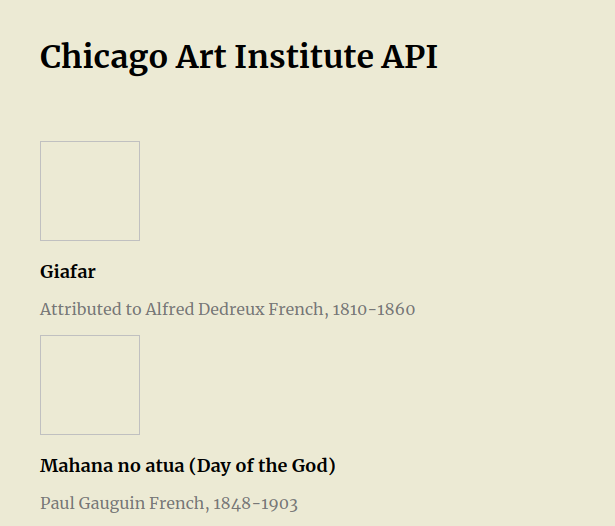

# chicago-art
Consuming the [API from Chicago Art Institute](https://api.artic.edu/docs/).

### Introduction
The [Art Institute of Chicago's](https://www.artic.edu/) API provides JSON-formatted data as a REST-style service that allows developers to explore and integrate the museum’s public data into their projects. This API is the same tool that powers their [website](https://www.artic.edu/), their [mobile app](https://www.artic.edu/visit/explore-on-your-own/mobile-app-audio-tours), and many other technologies in the museum.

### Technologies
- [HTML](https://developer.mozilla.org/pt-BR/docs/Web/HTML)
- [CSS](https://developer.mozilla.org/pt-BR/docs/Web/CSS)
- [Fetch API](https://developer.mozilla.org/pt-BR/docs/Web/API/Fetch_API)

### Preview

### Running
Just open the `index.html` in your browser.